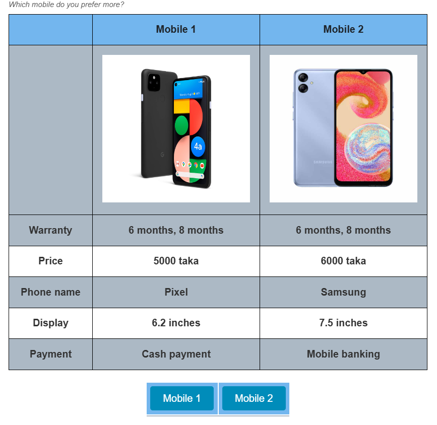

# Conjoint table list

# Description 

Conjoint-table plugin is an enhanced version of the original conjoint plugin developed by SurveyCTO. In the standard conjoint plugin, randomization of attributes or values are to be done within the plugin itself. This does not give flexibility to do the randomization or selection of values with any other criteria. This new conjoint-table plugin allows the user to fix the values in the SurveyCTO XLSForm as per their requirement and create the table accordingly.

In SurveyCTO, the conjoint table plugin allows attribute order to be randomized by setting `randomize=1`. However, if you need more control over how attributes are randomized—such as keeping specific attributes like "price" and "warranty" together with random order at the top of the list while allowing other attributes to appear in any order—the enhanced version of the conjoint table plugin can offer this added flexibility.

Additionally, this plug-in allows to add image as an attribute, i.e., add a product image for each of the products.

)

## Default SurveyCTO feature support

| Feature / Property | Support |
| --- | --- |
| Supported field type(s) | `text` `note` |
| Default values | No |
| Randomization| Yes|
| Media:image | Yes |
| Media:video | No |
|Media:audio | No |
| Delimiter| Yes|
|Custom constrain message | Yes |
|Custom required message | Yes |
|Read only | No |

# Case example- Why to randomize in the form 

**Dependency among attribute values:** Certain attributes depend on each other, meaning that specific values can only appear if another attribute meets a particular condition. For example:

* *Battery Life*: If the battery life is indicated as 5 years, then guarantee on the battery should not appear more than 5 years.

**More control on randomization of values:** There can be many reasons the research team may want to have more control over the randomization and table formation. For example, it may be important to group some of the attributes, and randomize the orders of the attributes only within the group. There can be other reasons, for example, they may not want an equal probability for each value to appear. 

Additionally, this plugin allows for the inclusion of images for profiles, making it ideal for studies requiring visual evaluations of products or services, such as packaging, branding, or design.

This plug-in works as a table generator while the randomization and array constructions happen using regular SurveyCTO calculations.

**Attribute randomization:** To avoid order bias, attributes (such as price, brand, warranty, battery life) need to be shuffled so that respondents see unique combinations in each scenario.

# How to use the plug-in? 

1. Download the [sample form](https://view.officeapps.live.com/op/view.aspx?src=https%3A%2F%2Fraw.githubusercontent.com%2FARCED-Foundation%2Fconjoint-table%2Frefs%2Fheads%2Fmaster%2Fextras%2Fform%2Fconjoint-table%2520example%2520form.xlsx&wdOrigin=BROWSELINK) from this repo and upload it to your SurveyCTO server.  
2. Download the [conjoint-table-bn.fieldplugin.zip](https://github.com/ARCED-Foundation/conjoint-table/blob/master/conjoint-table.fieldplugin.zip) from this repo, and attach it to the test form on your SurveyCTO server.  
3. Make sure to provide the correct parameters (see below).  
   

`custom-conjoint-table-bn(attributes = ${attributes}, level1 = ${levels_array1}, level2 = ${levels_array2}, image1=${c1_mbl_img}, image2=${c2_mbl_img}, labels='Mobile 1, Mobile 2')`  

# Step to step guide for randomization with a survey example:  

Let’s assume we want to conduct a conjoint experiment where "price" and "warranty" will be together in random order at the top of the list while allowing other attributes to appear in any order. The attribute list are given below:

| Attributes | Values |
| :---- | :---- |
| Phone name | "Nokia, Samsung, Redmi, Oneplus, Huawei,Pixel" |
| Price | "5000 taka, 6000 taka, 6500 taka, 8000 taka, 12000 taka, 15000 taka, 1700 taka" |
| Display | "5.5 inches, 6 inches, 6.2 inches, 6.5 inches, 7.5 inches" |
| Warranty | "If price is (5000, 6000 or 6500 taka) \= warranty (6 months, 8 months) If price is (8000 or 12000\) \= warranty(6 months, 8 months, 10 months) If price is (15000 or 17000\) \= warranty 1 year" |
| Payment | “Online payment,Cash payment” |

## Steps to-do:  

### Create Separate Arrays with randomization and join them according to preference: 
* Create a randomized array list for price and warranty.

* Create another randomized array list for display, phone name, and payment.

* Combine two arrays using the `join(delimiter, array1, array2)` function with `array1` containing the attributes (price, warranty)  to appear first.

### Randomization of Levels: {#randomization-of-levels:}

* Randomize and organize  level1 and level2 values into ordered arrays with a pipe ‘|‘ delimiter based on attributes.

**level1**

**level2**

### Parameter Placement: 

* Place the resulting calculated attributes array along with level1 and level2 values array in the plugin parameters.

## Detailed explanation  {#detailed-explanation}

| Type | Name | Calculation | Repeat count | Description |
| :---- | :---- | :---- | :---- | :---- |
| calculate | attributes\_mobile\_pw | “1,2” |  | Create a list with numbers that are delimited by ","  |
| calculate | attributes\_mobile\_name\_pw | "Price,Warranty" |  | Create a list of attributes that should appear at the beginning and be separated by delimited "," |
| Begin repeat | random\_draws\_pw |  | if(count-items(',', ${attributes\_ordered\_num\_pw})\>=count-items(',',${attributes\_mobile\_pw}), count(${rand\_attributes\_pw}), count(${random\_draws\_pw})+1) | Using the repeat count to control attribute placement helps decide which values should appear during each repetition. For example, if price is placed randomly in the ${attributesname\_ordered\_pw} calculation field on the first repetition, the repeat count would increase to 2, as warranty still needs to be placed. |
| calculate | rand\_attributes\_pw | once(random()) |  | Generate random values |
| calculate | randatt\_cat\_pw | int(\${rand\_attributes\_pw}\*count-items(',',${attributes\_mobile\_pw}))+1 |  | Randomly select either 1 or 2 items from the ${attributes\_mobile\_pw} attribute list. |
| calculate | randatt\_name\_cat\_pw | item-at(',', ${attributes\_mobile\_name\_pw}, ${randatt\_cat\_pw}-1) |  | Randomly select either price or display items from the ${attributes\_mobile\_name\_pw} attribute list. |
| End repeat | random\_draws\_attributes |  |  |  |
| calculation | attributes\_ordered\_num\_pw | de-duplicate(',', join(',', ${randatt\_cat\_pw})) |  | Join the values from ${randatt\_cat\_pw} after each repetition while removing any duplicates. |
| calculation | attributesname\_ordered\_pw | de-duplicate(',', join(',', ${randatt\_name\_cat\_pw})) |  | Join the values from ${randatt\_name\_cat\_pw} after each repetition while removing any duplicates.  |

### Create another  array for display, phone name and payment 

| type | Name | Calculation | repeat count | Description |
| :---- | :---- | :---- | :---- | :---- |
| calculate | attributes\_mobile\_gs | “1,2,3” |  | Create a list with numbers that are delimited by ","  |
| calculate | attributes\_mobile\_name\_gs | Display, phone name and payment" |  | Create a list of attributes that should appear after Price and Warranty in any order, and separated by delimited ‘,’ |
| Begin repeat | random\_draws\_gs |  | if(count-items(',', ${attributes\_ordered\_num\_gs})\>=count-items(',',${attributes\_mobile\_gs}), count(${rand\_attributes\_gs}), count(${random\_draws\_gs})+1) | Using the repeat count to control attribute placement helps decide which values should appear during each repetition. For example, if payment and display is placed randomly in the ${attributesname\_ordered\_pw} calculation field on the first repetition, the repeat count would increase to 3, as the phone name still needs to be placed. |
| calculate | rand\_attributes\_gs | once(random()) |  | Generate random values |
| calculate | randatt\_cat\_gs | int(${rand\_attributes\_pw}\*count-items(',',\${attributes\_mobile\_pw}))+1 |  | Randomly select either 1,2 or 3 items from the \${attributes\_mobile\_gs} attribute list. |
| calculate | randatt\_name\_cat\_gs | item-at(',', ${attributes\_mobile\_name\_gs}, ${randatt\_cat\_gs}-1) |  | Randomly select either phone name, payment or display items from the ${attributes\_mobile\_name\_gs} attribute list. |
| end repeat | random\_draws\_attributes\_gs |  |  |  |
| calculate | attributes\_ordered\_num\_gs | de-duplicate(',', join(',', ${randatt\_cat\_gs})) |  | Join the values from ${randatt\_cat\_gs}after each repetition while removing any duplicates. |
| calculate | attributesname\_ordered\_gs | de-duplicate(',', join(',', ${randatt\_name\_cat\_gs})) |  | Join the values from ${randatt\_name\_cat\_gs} after each repetition while removing any duplicates.  |

### Combine two arrays using the join function 

| name | calculation | description |
| :---- | :---- | :---- |
| attributes | join(',',${attributesname\_ordered\_pw},${attributesname\_ordered\_gs}) | Combine the two arrays ${attributesname\_ordered\_pw} (containing Price and Warranty) and ${attributesname\_ordered\_gs} (containing Display, Phone Name, and Payment) into a single list with Price and Warranty at the top, you can using the join function by placing ${attributesname\_ordered\_pw} first. |

### 

### Randomization values array for the parameters level1 and level2 

### Phone name selection for both level1 and level2:

| name | Calculation | Description |
| :---- | :---- | :---- |
| mobile array | “"Nokia, Samsung, Redmi, Oneplus, Huawei,Pixel"” | Create a list with phone names that are delimited by ","  |
| c1\_mobile | once(item-at(',',${mobile\_array},(int(count-items(',',${mobile\_array}))\*random()))) | For the level1, this will select one value at a time at random.  |
| c2\_mobile | once(item-at(',',${mobile\_array},(int(count-items(',',${mobile\_array}))\*random()))) | For level2, this will select one value at a time at random.  |

### Random selection for mobile price for both level1 and level2:  

| Name | calculation | description |
| :---- | :---- | :---- |
| mobile\_price\_array | "5000 taka,6000 taka,6500 taka,8000 taka,12000 taka,15000 taka,17000 taka" | Use a list with the delimited "," for mobile price values.  |
| c1\_mobile\_price | once(item-at(',',${mobile\_price\_array},int(count-items(',',${mobile\_price\_array}))\*random())) | For the level1, this will select one number at random from the mobile\_price\_array. |
| c2\_mobile\_price | once(item-at(',',${mobile\_price\_array},int(count-items(',',${mobile\_price\_array}))\*random())) | For level2, this will select one number at random from the mobile\_price\_array. |

### Random selection for warranty based on mobile price.  

| Name | calculation | description |
| :---- | :---- | :---- |
| c1\_warranty | "if((\${c1\_mobile\_price} \= ""5000 taka"" or \${c1\_mobile\_price} \= ""6000 taka"" or \${c1\_mobile\_price} \= ""6500 taka""), ""6 months, 8 months"", if((${c1\_mobile\_price} \= ""8000 taka"" or \${c1\_mobile\_price} \= ""12000 taka""), ""10 months, 1 year"", if((\${c1\_mobile\_price} \= ""15000 taka"" or \${c1\_mobile\_price} \= ""17000 taka""), ""1.5 year"", """"))) "  | Depending on the \${c1\_mobile\_price} warranty is calculated. For example: if mobile price value is 15000 taka the calculated value will be 1.5 year  |
| c2\_warranty | "if((\${c2\_mobile\_price} \= ""5000 taka"" or \${c2\_mobile\_price} \= ""6000 taka"" or \${c2\_mobile\_price} \= ""6500 taka""), ""6 months, 8 months"", if((\${c2\_mobile\_price} \= ""8000 taka"" or \${c2\_mobile\_price} \= ""12000 taka""), ""10 months, 1 year"", if((\${c2\_mobile\_price} \= ""15000 taka"" or \${c2\_mobile\_price} \= ""17000 taka""), ""1.5 year"", """"))) "  | Depending on \${c2\_mobile\_price} item, calculate warranty. For example: if mobile price value is 15000 taka the calculated value will be 1.5 year  |

### Random selection for Display for both level1 and level2:  

| Name | calculation | description |
| :---- | :---- | :---- |
| c1\_display\_array | "5.5 inches, 6 inches, 6.2 inches, 6.5 inches, 7.5 inches" | Use a list with the delimited "," for mobile display values.  |
| c1\_mobile\_price | once(item-at(',',${c1\_display\_array},int(count-items(',',${c1\_display\_array})\*random()))) | For level1, this function selects one value at random from c1\_display\_array. |
| c2\_mobile\_price | once(item-at(',',${c1\_display\_array},int(count-items(',',${c1\_display\_array})\*random()))) | For the level2, this function selects one value at random from c2\_display\_array. |

### Construct level1 and level2 based on attributes values and join them 

| type | name | calculation | repeat count | description |
| :---- | :---- | :---- | :---- | :---- |
|  begin repeat | level\_construct |  | 5 | Set the repeat count based on the number of attributes in your combined list |
| calculate | serial | item-at(',', ${attributes}, index()-1) |  | Randomly pick attributes from previously constructed attributes array  |
|calculate  | value\_1 | "if(${serial}="Price", ${c1\_mobile\_price},if(${serial}=""Warranty"", ${c1\_warranty}, if(${serial}=""Display"", ${c1\_display}, if (${serial}=""Payment"",${c1\_pay},${c1\_mobile})))) "  |  | Assign values for level\_1 from the randomized value lists based on the attribute indicated in the ${serial} field |
|calculate  | value\_2 | if(${serial}="Price", ${c2\_mobile\_price},if(${serial}="Warranty", ${c2\_warranty}, if(${serial}="Display", ${c2\_display}, if (${serial}="Payment",${c2\_pay},${c2\_mobile})))) |  | Assign values for level\_2 from the randomized value lists based on the attribute indicated in the ${serial} field |
| end repeat | level\_construct |  |  |  |
| calculate | levels\_array1 | join('|', ${value\_1}) |  | Join the randomly generated values from ${valu\_1} using delimited ‘|’ |
| calculate | levels\_array1 | join('|', ${value\_1}) |  | Join the randomly generated values from ${valu2\_2} using delimited ‘|’ |

## Parameters 

| key | Value |
| --- | --- |
|`attributes` | Comma-separated list of attributes. |
| `level1` |A comma-separated set of values representing the attributes for profile 1, which may include various characteristics such as color, size, and features.
|`level2` | A comma-separated set of values representing the attributes for profile 2, which may include various characteristics such as color, size, and features.
| `image1` | A file path pointing to an image associated with the level1, used to visually represent the product or service feature in the survey.
|`image2`| A file path pointing to an image associated with the level2, used to visually represent the product or service feature in the survey.
|`lebels`| label for the the pair of profiles profiles.

> **Example:**

Here is an example *appearance* for your *text* field that uses this field plug-in: 

    `custom-conjoint-table-bn(attributes = ${attributes}, level1 = ${levels_array1}, level2 = ${levels_array2}, image1=${c1_mbl_img}, image2=${c2_mbl_img}, labels='Mobile 1, Mobile 2')`

You can read more about how to use this plugin [here](link to the more information) (includes a downlodable step-by-step breakdown of using this field plug-in)

## Author
<u>[Mehrab Ali](https://github.com/mehrabali)
</u>

<u>[ARCED Foundation](https://www.arced.foundation/)</u>

Email: <u><mehrab.ali@arced.foundationn></u>

<u>[Tasmin Binte Mamun (Pritha)](https://github.com/prithapritha)</u>

<u>[ARCED Foundation](https://www.arced.foundation/)</u>

Email: <u><tasmin.pritha@arced.foundation></u>
### More resources 
* **sample form**
You can find a form defination in this repo here: [sample form](https://view.officeapps.live.com/op/view.aspx?src=https%3A%2F%2Fraw.githubusercontent.com%2FARCED-Foundation%2Fconjoint-table%2Frefs%2Fheads%2Fmaster%2Fextras%2Fform%2Fconjoint-table%2520example%2520form.xlsx&wdOrigin=BROWSELINK)
* **Developer documentation**
More instruction for developing and using field plug-ins can be found here: <u><https://github.com/surveycto/Field-plug-in-resources></u>
* **User documentation: How to get started using field plug-ins in your SurveyCTO form.**
<u><https://docs.surveycto.com/02-designing-forms/03-advanced-topics/06.using-field-plug-ins.html></u>

